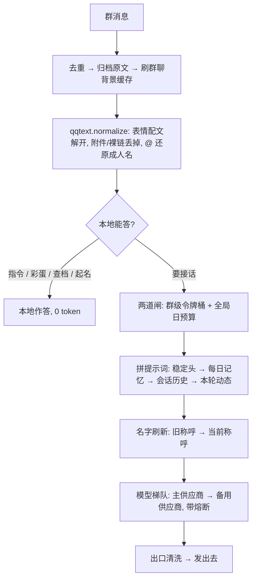

# micro-banter-harness

[English](README_EN.md) · **中文**

## The Regular —— 一个常驻你们群的 AI 群友，不是助理

**Version**: 1.1 · **Author**: Leo (dubianche123) · **Runtime**: Python 3.10+ / [qq-botpy](https://github.com/tencent-connect/botpy) · **License**: MIT
**跑着的地方**: 一个真实的 QQ 群，7×24 —— 下面所有数字都是它在群里跑出来的，不是压测编的

它只做一件事：**像群友一样在群里待着**。不抢答、不总结、不说「有什么可以帮您」；大部分时间潜水，偶尔接一句；记得住谁是谁、跟谁熟、谁欠谁一顿奶茶；模型挂了会自动换一家，换回来的时机由缓存说了算。

**状态由代码持有，模型只负责把状态说成人话。**

> 它本质上是个**超微 harness**。正经 agent harness 里那几件难事 —— 确定性的状态、稳定的前缀、可预期的降级 —— 被压到一个群友的体量里：没有框架、没有数据库、五个依赖，全部代码几千行。借过来的不是代码，是取舍。

好感度是一个整数，账本在 `state.json` 里，分级、衰减、排名全是本地代码算的 —— 模型碰不到数字，也就编不出「我们上周不是还一起……」这种没发生过的往事。名字同理：谁叫什么以档案为准，改过名之后**旧名字不会再出现在任何喂给模型的文本里**。

---

## 它跟「接个 API 就上」的群聊机器人差在哪

| 常见做法 | 这里的做法 | 为什么 |
|:--|:--|:--|
| 每轮让模型自评好感度 | 模型只判断情感倾向，分数由代码加 | 数字由代码持有，模型编不出来；也不再要求它额外吐 JSON |
| 一次性喂一周聊天记录当记忆 | 滚动压缩：新摘要 = f(旧摘要, 当天新增) | 开销恒定，不受群多吵影响；也避开长文本的中段遗忘 |
| 靠提示词拦敏感词 | 代码词表 + 模型审核两道闸 | 对照实测：光加提示词，输出里命中的词**一处没少**（2 vs 2） |
| 让模型自己记住谁叫什么 | 名字是档案里的状态，喂进去之前统一刷新 | 旧名回流会让它拿旧名叫人，甚至把旧名新名当成两个人 |
| 供应商挂了就换家 | 让位时机由**缓存时效**决定 | 换一家要把整段前缀重算一遍，能命中就命中 |
| 代码里写死**触发词**（机器人叫什么）/ 群主外号 | 运行期解析（`naming.py`），触发词走 `BOT_NAMES` | 换个群、换个人部署、群主改个名，都不用回来翻代码 |
| 消息格式用正则枚举 | 占位符交给渲染器注册表（`qqtext.py`） | 平台加一种新格式，只加一个渲染函数，不动解析 |

---

## 五分钟跑起来

### 1. 先设触发词（不设它不知道你在叫它）

**触发词**就是机器人在群里被叫到的名字。它同时管三件事：识别「这句话是不是在叫它」、剥掉喊人前缀（「阿黄，叫小满」→「叫小满」）、提示词里的自称。

**这是部署时最该先改的一处** —— 也恰恰是最容易被写死的一处：名字一旦散进提示词、正则、彩蛋台词和日志，换个人部署、换个群，就得回来翻代码。所以代码里一个具体人名都不留，全部运行期解析。

触发词有**且只有一个**权威来源 —— `.env` 的 `BOT_NAMES`：

```env
# .env —— 支持多个别名，逗号分隔
BOT_NAMES=你给它起的名字,别名1,别名2
```

支持多个别名是真实需求：有人直接喊名字，有人喊「@名字」，指的都是它。

> ⚠️ **别把「在 QQ 那边改昵称」当成设置触发词的办法。** 平台昵称（机器人在 QQ 上的用户名）只是**补充**：进程启动时顺手读一次，当成一个额外别名 —— 它只会**多**一个叫法，**永远不会改掉、也不会顶掉**你在 `BOT_NAMES` 里配的那些。所以换个昵称并不能换掉触发词，旧触发词照旧生效；想换触发词就改 `BOT_NAMES`。另外昵称是登录时读的，**改了要重启进程才生效**。
>
> 两者都拿不到时（`BOT_NAMES` 留空、昵称也取不到），才退回通用词「机器人」。

> ⚠️ 别把**触发词**和**称呼**混了：触发词是「机器人在你们群里叫什么」（本节），称呼是「它怎么称呼群友 / 群主」（第 2 步的认主、`relations.py`）。两件事都靠配置、都不写死在代码里，但**触发词不配好，后面所有功能都触发不了**。

#### 它只适配「收全量群消息」那种机器人（这一档要手动改）

**把机器人拉进群、并把群消息范围设成「获取群内全部消息」之后，它看到的是群里全部消息，而不是只有 @ 它的那几条。** 这是本项目的前提：它得靠上下文判断该不该接话、记不记得住事，只收到 @ 的那几条就等于瞎了。

注意区分「**收**全量」和「**回**全量」：它收的是全部消息，但回不回是另一回事 —— @ 它或喊触发词必回，其余时候按概率插嘴，大部分消息它只是安静看着（不然就成了刷屏机器人）。

平台上给机器人的群消息范围有**三档**，本项目**按第三档写的**（平台措辞可能随版本略有出入，用「能不能看到别人不 @ 它的日常闲聊」就能对上）：

| 平台给的档位 | 它能看到什么 | 本项目的适配情况 |
|:--|:--|:--|
| 只 @ 才推 | 只有被 @ 它的那几条 | ⚠️ 能回 @，也**只剩**回 @ |
| @ 那条 + @ 之前一小段 | 被 @ 的那条，再加 @ 之前最近的若干条（实测是前 10 条） | ⚠️ 同上，只是多带了 @ 前后一小段 |
| 全部消息 | 群里所有消息 | ✅ **本项目按这个写的**，也请按这个配 —— 这一档**默认不是它，要手动改** |

**先把「不回」和「不能回」分清：前两档它照样正常回 @、也照样应触发词，功能是通的。** 丢掉的**只有上下文管理** —— 它看不到群里此前聊过什么，于是记不住事、也不会主动插嘴。换句话说，前两档下它退化成一台「@ 了才答」的问答机器人，本项目要的那种「像个群友一样待在群里」全部不成立。而且这**不报错**，只会静默地变傻。

⚠️ 这个开关**不在 QQ 开放平台，而在 QQ 群里**，并且**只有群主能改、每个群要各改一次**：
群设置 → 找到挂在本群的那个机器人 → 把「机器人可获取的群聊消息范围」设成「获取群内全部消息」。

代码这边也补了一层事件解析作配套 —— `botpy` 默认只分派 @ 消息，`bot.py` 顶部把 `GROUP_MESSAGE_CREATE` 也分派进了主流程。

### 2. 先认领群主（别跳这一步）

认领**在私聊里办，不在群里**。私聊机器人发一句暗号，第一个说对的人被永久写进 `owner.txt` —— 之后只有他能给别人起名、能喊特权指令。

暗号默认是「认主」，**部署前请改成只有你知道的一句**（`.env`）：

```env
OWNER_CLAIM_PHRASE=你自己定一句
```

> ⚠️ **为什么不在群里认**：群聊是大声公。口令念在群里等于念给所有人听，而且是「谁先喊谁得」—— 随手一个群成员、甚至根本不在群里的人，都能把身份抢走。所以群里说破天也**不授权**：它只会回一句「认领得私聊办」，每个群最多回一次。不信可以自己进群喊一声试试。
>
> ⚠️ 认领是**一次性**的，不能转移：认领之后再有人说对暗号，也只会收到「已经有人认领过」。所以口令将来就算泄了，也换不掉这个位置。
>
> ⚠️ 这是最容易漏、也最难自查的一步：没人认领时机器人照常聊天，看起来一切正常，只是**所有群主功能静默失效**。所以它自己会提醒 —— 启动日志里写明「还没有群主认领」，进群后第一条回复也会捎一句怎么认领（每群一次），私聊里说了句像认领但没对上暗号的话也会明说。
>
> 想换人认领：停服 → 删掉 `owner.txt` → 重启，让新人重新认领一次。

顺带一个细节：暗号会被登记成运行时敏感词。万一真有人在群里把它念出来，摘要出口会就地抹掉，不会让它顺着长期记忆回流进每一轮 prompt（那等于把口令抄进了模型上下文）。

### 3. 装依赖

```bash
python3 -m venv .venv && source .venv/bin/activate
pip install -r requirements.txt
```

依赖只有五个：`qq-botpy` / `openai` / `httpx` / `aiohttp` / `certifi`。**没有数据库**（一个群的数据量，`json` 够了），没有 web 框架，没有 ORM。

### 4. 填 `.env`

```bash
cp .env.example .env
```

最少只要四项：

| 变量 | 说明 |
|:--|:--|
| `QQ_APP_ID` | QQ 开放平台 → 开发设置里的 AppID |
| `QQ_APP_SECRET` | 同上 |
| `AI_PROVIDER` | `gemini`（快，要代理）或 `zhipu`（直连稳，慢些） |
| `GEMINI_API_KEY` / `ZHIPU_API_KEY` | 对应主供应商的那把 |

其余全部有默认值，不填也能跑（完整清单和默认值见 `.env.example` 与 `config.py`）。
只有两个例外，都在前面两步单独讲过：**`BOT_NAMES`（触发词，第 1 步）没有默认人名**，`OWNER_CLAIM_PHRASE`（认主暗号，第 2 步）默认是公开的「认主」。
两家都走 OpenAI 兼容协议，所以**调用代码完全共用**，换供应商只改一行 `AI_PROVIDER`。

### 5. 平台上要开的东西

- 在 QQ 开放平台建一个机器人，把它拉进群。
- **群消息范围设成「获取群内全部消息」**（第 1 步那三档里的第三档）。⚠️ 这个开关在**QQ 群设置**里，**只有群主能改、每个群要各改一次**，不是开放平台上的消息订阅 —— 理由和第 1 步那张表一样。
- **认主走私聊，所以要开单聊（C2C）消息权限** —— 不开的话，第 2 步的认领动作收不到任何回应，而且同样是静默的。
- 还在沙箱阶段的话，记得把测试群加进沙箱群列表，否则消息根本不推给你；私聊同理，沙箱下对方也得在测试成员名单里。

### 6. 启动

```bash
./.venv/bin/python -u bot.py
```

后台常驻：

```bash
nohup ./.venv/bin/python -u bot.py >> bot.log 2>&1 &
```

需要代理才连得上 Gemini 的网络（智谱是直连的，必须把它排除，否则它的流量也会绕代理）：

```bash
HTTP_PROXY=http://127.0.0.1:7890 HTTPS_PROXY=http://127.0.0.1:7890 \
NO_PROXY=bigmodel.cn,open.bigmodel.cn ./.venv/bin/python -u bot.py
```

缺凭证会**启动即失败并告诉缺哪一项**，不会带着残缺配置跑起来。

---

## 群里能玩什么

| 玩法 | 怎么说 | 花不花调用 |
|:--|:--|:--|
| 聊天 | @它，或者直接喊它的**触发词**（`BOT_NAMES` 里配的那些叫法） | 1 次 |
| 主动插嘴 | 不用喊，8% 概率接一句；聊到群主时 25%。**概率再乘一个亲密度权重**：熟人 1.6×、生人 0.7×、黑名单 0.3×，没说过话的新人 1.0×（不因「还不熟」被晾着）。基数不动，所以群里整体话量不变，变的只是「更愿意接谁」 | 1 次 |
| 赛博决斗 | 摇骰子 / 掷骰子 / 比大小 / 决斗 / 色子 | 0，本地文案，还涨好感 |
| 本地梗彩蛋 | 说中就接（只在没被 @ 时，40% 概率、60 秒冷却；默认几条游戏圈的梗，改 `bot.py` 的 `LOCAL_MEMES`） | 0 |
| 模式切换 | 猫娘模式 / 风纪委员模式 / 发疯模式 / 算命模式 / 飙车模式 | 0 |
| 退出模式 | 恢复正常 / 正常点 / 冷静点 / 散会 / 收摊 / 吃药了 / 变回<它的名字> | 0 |
| 认领称呼 | 叫我阿远 / 我是阿远 / 取消我的称呼 / 别叫我了 | 0（被词表拦下）/ 1（过了词表，让审核看一眼，约 137 token） |
| （群主）给别人起名 | @某人 叫他阿远（对方得先在群里说过话，机器人才能拿到他的 ID） | 同上 |
| （群主）锁起名 | 锁起名 / 禁止起名 ；解锁起名 / 开放起名 —— 锁上后本群「叫我 XXX」一律不办，落名权收归群主 | 0 |
| 查交情 | 查好感 / 我跟你多熟 / 几档了 | 0 |
| 看榜单 | 关系榜 / 点名册 / 群友榜 | 0 |
| 查称呼表 | 称呼表 / 谁是谁 | 0 |
| 群史记 | 群史记 / 最近聊了啥 / 周报 | 0 |
| 承诺账本 | 查账 / 谁请客 ; 兑现了就说「结清」 | 0 |
| 翻旧账 | 翻旧账 <关键词>（回原文查证） | 0 |
| 手动压缩 | 立刻总结 / 压缩记忆 | 1 次起 |
| （群主）特权台词 | 办他 / 拖出去 / 拿下 / 护驾 | 0 |
| 私聊 | 直接单聊它 | 1 次 |

⚠️ **改名只在群里办**。称呼是按群存的（`群号|openid`），而私聊消息里没有群号 ——
改了也不知道该改在哪个群。私聊说「叫我阿远」**不会**改档，它会回一句指你回群里说
（本地文案，0 token、不扣额度），不会一声不响地吞掉你的命令。

绝大多数指令是**本地命中就答**，一个 token 都不花，也完全不碰模型。

---

## 名字分主副，而且只保留最新那一版

这是这个项目里最容易被忽略、又最容易翻车的一处状态。

**主名**是当事人自己定下来的那一版称呼，只认两个来源：他自己认领/改名（`claim`），或群主授权给他改名（`owner`）。写入口只有一个（`RelationStore.set_nick`），合法来源写死在白名单 `MAIN_NAME_SOURCES` 里，别的来源一律拒绝 —— 而且**连清空都不给**，免得留下「不能改、但能被抹掉」这种半开的门。这条守卫是后补的：在此之前它只是「碰巧没有别的调用点」，没有任何东西拦着。

**副名**是闹着玩的那一层：改名前留下的旧叫法、别人起哄叫过的称呼。它不占档案字段，归 `RenameLedger` 管，只在注入 prompt 之前把旧字面改写成**当前**称呼。方向是单向的 —— 副名可以退成主名，主名绝不许被副名顶掉（`main_names()` 就是那份豁免名单）。

**主名不能重叠**：一个群里两个人不能叫同一个名字 —— 否则机器人分不清谁是谁。别人占着的主名，第二个人拿不走，群主的改名权也不例外。但「随时可以覆盖」不能被这条挡住：占用是**按 openid 算**的，不按字面算，所以本人当前那一版永远放行（他随时能改掉自己的名字），群主给被 @ 的那位改名同理。拒绝理由也分开说 —— 冒名顶替是「这个名字不让用」，撞名是「群里已经有人叫这个了」；群主撞上的是后者，提示得对得上他才不会以为功能坏了。

问题出在「名字会出现在模型的产出里」：长期记忆是模型写的，里面自然带着称呼；会话窗口里也压着机器人自己说过的话。于是改一次名之后，**旧名字还躺在那些文本里**，而它们每一轮都会被注入 prompt —— 模型接着用旧名叫人，更糟的是它会把旧名和新名当成两个人，开始编「那谁和这谁」的往事。

解法是把名字当成**状态**，而不是文本：

| 环节 | 做法 |
|:--|:--|
| 名字存哪 | 关系档案（`state.json` 的 `relations`），代码持有，模型碰不到 |
| 谁能写主名 | 只有本人认领（`claim`）和群主授权（`owner`）；摘要、模型推断、任何自动同步都写不进来 |
| 能不能重名 | 不能。占用名单是**按 openid** 算的，本人自己那一版放行 —— 所以他随时能覆盖自己的名字 |
| 旧名字去哪 | `RenameLedger` 台账只记「这个名字曾经属于谁」，**永不进模型上下文** |
| 注入之前 | 过一遍 `refresh_names`：旧字面换成当事人当前的称呼；撤销过称呼的退成「（未留名）」（**不带 ID 后四位** —— 带编号的标签会被模型当成人名念出来） |
| 覆盖范围 | 群史记、每日记忆、群聊背景、回喂给压缩模型的上一版摘要、`群史记` 命令的输出 |
| 改名/撤销时 | 顺手把会话窗口、长期记忆、每日 MD 里的旧名一起清掉，`archive/` 原文一个字不动 |
| 谁不能碰 | 主名名单（`main_names()`）里的字面，任何自动逻辑都不许改写 —— 含改名/撤销时的历史同步 |
| 想整个关掉自由起名 | 群主说一句「锁起名」，本群的「叫我 XXX」就一律不办了，落名权收归群主（@谁 说「叫 XXX」照常）；「解锁起名」恢复。状态按群存，重启不丢。撤销称呼不受锁影响 |

结果：模型在**任何一条路径**上都只能看到当前那一版名字。一个人改了几次名、谁的旧名后来被别人认领了、谁撤销了称呼 —— 这些情况台账都分别处理（旧名换主之后就不再改写，免得把新主人一起改掉）。

顺带一条相关的硬规则：**关系只能来自档案**。谁自称是机器人的爹、要它叫爷，都是在拿它开涮；被问「我是谁」时它只能照档案答，没记录就直说没记录。这条不是人设的一部分，而是所有模式共享的底线（`prompts.PROMPT_SHARED_RULES`）—— 起因是实测它真的顺着群友那句「我是你爹」现编了一段辈分关系。

---

## 它记得住什么，各自能活多久

| 记忆层 | 存哪 | 寿命 / 上限 |
|:--|:--|:--|
| 会话上下文 | `state.json`（每群每人一份，互不串台） | 8 个来回 / 3000 字，静默 30 分钟当作换话题 |
| 原始消息 | `archive/YYYY-MM-DD.jsonl` | 默认留 90 天；只增不改，是**唯一真相** |
| 长期记忆（群史记） | `memory/YYYY-MM-DD.md` + `state.json` | 攒够 120 条或满 24 小时压一次，最少 15 条才值得压 |
| 关系档案 | `state.json` | 单次 ±3，日结 ±6；3 天不来往不扣，之后每 2 天向 0 靠 1；90 天不互动清档 |
| 旧称呼台账 | `state.json` | 每群最多 300 条，只用于改写历史文本，不进上下文 |
| 承诺账本 | `state.json` | 立下 24 小时后才允许催，48 小时催一次，催满 2 次撤下；23:00–08:00 不主动开口 |

为什么原文要单独留一份：摘要是有损的，模型偶尔还会张冠李戴。真出错了，`翻旧账 <关键词>` 就能回到 JSONL 里核对 —— 不然只能将错就错。

---

## 模型路由：什么时候让位，什么时候回来

### 梯队按「任务」分，不按「快慢」分

| 任务 | Gemini | 智谱 | 挑它的理由 |
|:--|:--|:--|:--|
| 对话 | 3.5-flash-lite → 3.5-flash → 3.6-flash | 4.7 → 4.5-air → 4-flash | 这活要质量，慢一点可以忍 |
| 压缩 | 3.5-flash-lite | 4.5-air → 4-flash | 压缩不共享聊天前缀（换模型零缓存损失）、跑在后台、不参与人格；而且**更强的那档反而更容易被内容过滤拒掉** —— 同一份 transcript，4.7 直接 1301，4.5-air 正常出结果 |
| 称呼审核 | 3.5-flash-lite | 4.7 | 只有强档认得出谐音、拆字、暗指（实测 4.5-air 会漏、还误杀正常昵称） |

`call_model(messages, max_tokens, tier="chat")` 里的 `tier` 就是这一层的开关，加新梯队只要在 `_TIER_CHAINS` 登记一行。

### 让位：缓存优先

主供应商（Gemini）抖一下就切到备用（智谱），但**什么时候切回来**不看冷却时间，看缓存：

```
可用 = 熔断冷却过了  AND  群已经静下来 ≥ PROVIDER_CACHE_WARM_SECONDS（默认 600s）
```

群里一直在聊，就一直留在正在服务的那家 —— 被让位那家的暖前缀还在，切回去等于把已经付过钱的 prefill 白扔。等群静到超过缓存时效，切换才是免费的，这时候才回去重试。

两条配套规则：

- **硬失败**（代理断、地区不支持、Key 无效）不数次数，第一次就直接让位 —— 这几个换模型、换 Key 都救不回来，硬试只会让群友白等十几秒。判定要**连异常类名一起看**：代理断掉时 `str(e)` 只有一句 `Connection error.`，关键词一个都不在里面。
- **只有「别家顶得上」时才让位**。备用也挂了就必须让主供应商自己上，否则一级熔断 + 一级失效 = 整条链全哑。
- **结构性故障要单独隔离**（`_is_fatal_fail` / `PROVIDER_FATAL_COOLDOWN_SECONDS`，默认 30 分钟）：地区封禁、Key 失效跟代理抖动的区别不是严重等级，而是**会不会自己恢复** —— 前者由出口 IP / 凭证决定，两分钟后再试必然还是同一个错。实测 2026-09-17~18，Gemini 卡在 `User location is not supported` 一天半，这类 400 撞了 **39 次**（每 120 秒冷却一到就被放回来重撞一轮，每轮还要连试 3 档模型），全员熔断时更因为它「冷却剩余最短」被挑去带伤上阵。现在这类错一次命中就关进长隔离窗，并且不许抢带伤上阵的名额（除非别无选择）。

「熔断中还剩 Xs」和「结构性故障，隔离中」在日志里是分开写的 —— 前者值得一等，后者不用盼。

还有一条配套的轻重手（没人兜底时别把整家摁死）：单模型超时 ≠ 整家链路断了，4.7 答不上来不代表 4.5-air 也答不上来。所以**有别家顶着时**，一次硬失败就立刻把这家拉黑（别让用户每档都白等一轮）；**没人顶着时**降级为普通失败（记一笔，凑够阈值才禁），让梯队里剩下的便宜档有机会把话说完。实测事故（2026-09-18 16:11）：Gemini 正被结构隔离、智谱 4.7 一次 20 秒超时 → 整家被关 120 秒，4.5-air / 4-flash 连一次机会都没有，用户当场吃到一句兜底话术。总超时 `AI_TOTAL_TIMEOUT`（30s）仍然兜着最坏情况。

### 实测：缓存到底能活多久

`tests/probe_cache_ttl.py`（1340 字稳定前缀，全程几十个 token）：

| 距上次请求 | 智谱（≈994 token） | Gemini（≈1090 token） |
|:--|:--:|:--:|
| 预热 | 1% | 0% |
| 立刻复用 | **99%** | 0% |
| 60s / 120s / 240s | 98% ~ 99% ✅ | 0% ❌ |
| 420s | **99%**（边界没探到） | 0% ❌ |

两点结论：智谱缓存至少活 7 分钟，所以窗口取 600 秒留余量；**Gemini 那次一次都没命中**，连「立刻复用」也是 0 —— 请求体 1090 token 已经超过官方 1024 的下限，所以不是「不够大」，是这一档模型在这个体积下吃不到隐式缓存。也就是说「缓存优先」实际只在智谱这一侧有意义，切回 Gemini 不损失任何缓存。

> 想自己复现：`cd tests && ../.venv/bin/python probe_cache_ttl.py --gemini`（约 21 分钟，token 消耗可忽略）。

---

## 一条消息的旅程



### 提示词的排列顺序就是缓存策略

```
1) 稳定头    角色 + 共享硬规则 + 协议 + 排版约束   ← 与「谁在说、说到第几句」全无关，全群全天共享
2) 每日记忆  群长期记忆                          ← 一天只变一次（压完才动）
3) 会话历史  每轮只往后追加                      ← 天然前缀稳定
4) 本轮动态  群聊背景 + 对说话人的印象 + 插嘴指令  ← 全部塞在最末尾
```

**任何随发言人或轮次变化的内容都不许往 1) 里塞** —— 它之后的一切会跟着一起作废。以前群主身份、群聊背景、关系档案全挤在 system 里，等于把缓存全废了。这条不变量没有报错、只会悄悄变慢变贵，所以专门写了测试钉住（`tests/test_harness.py`）。项目内记录：重排前命中率 85%，重排后 98%。

### 出口还有一道本地清洗

模型有时会把聊天记录里的敏感词照抄进记忆。摘要在出口过一遍 `wordfilter.scrub`，命中的词就地替换成占位符 —— 就地替换而不是删行，删行会把句子截断成半截，看着像坏了。

---

## 开源不带你群里的名字

这个机器人从第一天就是按「会被开源、会被搬到别人的群里」写的，所以源码里**一个具体人名都没有**：

| 问题 | 解法 | 在哪 |
|:--|:--|:--|
| **触发词（它在群里叫什么）** ← 最优先 | `.env` 的 `BOT_NAMES`（可多别名）为准；平台昵称只当附带别名，改不掉配置里那些；代码里不留默认人名 | `naming.py` |
| 它平时怎么自称 | 同上那一串的第一个，走 `{bot}` 占位符替换 | `naming.py` + `prompts.py` |
| 群主怎么称呼 | 他自己认领的称呼（私聊说暗号认主 + 群里说一句「我是XX」），没认领就退回通用词「群主」 | `naming.py` + `relations.py` |
| 提示词/台词里的名字 | 一律写 `{bot}` / `{owner}` 占位符，发送前 `naming.render` 替换 | `prompts.py`、`bot.py` |
| 识别「是不是在叫它」/ 剥喊人前缀 | 用同一串触发词现拼正则，不写死任何字面 | `relations.py` |
| 黑名单里写死群主外号 | 改成职务通用词 + **按当前实际叫什么现取** | `relations.py` |
| 旧名字残留在记忆里 | 台账 + 注入前刷新，模型只看得到当前那一版（改名 ≥2 字；单字名不记，替换会误伤一片） | `relations.RenameLedger` |
| 压缩记忆时说不出名字的人 | 用泛称「一位群友」署名，**不用 openid 后四位**。旧版拿编号顶上，摘要里就出现了「6ABA」这种人名，而摘要每轮进 prompt，模型当真人叫 | `digest.UNAMED_WHO` |
| 承诺账本里的旧名 | 催债和查账前都过一遍刷新 —— 账本存的是当时的称呼 | `bot.dun_promises` |
| 谁有权写称呼 | 来源白名单（本人认领 / 群主授权），其余一律拒绝 | `relations.MAIN_NAME_SOURCES` |
| 敏感词（谐音、暗号、本名） | 不写进仓库：通用词内置在代码，具体词放 `sensitive_nicks.txt`（已 gitignore，模板见 `sensitive_nicks.example.txt`） | `wordfilter.py` |
| 群聊原文 / 摘要 | `archive/`、`memory/`、`state.json` 全部 gitignore，另附 `.backup/`（清档时留的手动备份，同样是原文） | `.gitignore` |

> 顺序是有讲究的：**触发词比称呼更优先**。称呼写错了，它顶多把人叫得别扭；触发词写错了，它在群里就是个哑巴 —— 喊它不应、也不会主动接话，而且不报错。

`naming.render` 用的是字符串替换而不是 `format` —— 提示词里有 `{"aff": 2}` 这样的字面花括号，`format` 会直接 KeyError。

---

## 实测数据

| 指标 | 结果 | 备注 |
|:--|:--|:--|
| 对话延迟 | Gemini 3.5-flash-lite **1.1~1.7s** / glm-4.7 **4.7s** | 同一份 1186 字 system 的插嘴请求 |
| prompt token | **297** vs 1149 | 同上，智谱是 Gemini 的四倍 |
| 前缀缓存 | 智谱 99% 命中（420s 仍在）；Gemini 0% | 见上表 |
| 提示词重排 | 命中率 85% → 98% | `test_harness.py` 记录 |
| 插嘴频率 | 8% × 113 条候选 / 10.8 小时 ≈ **7 次/天** | 上线后按日志统计 |
| 文字长度门槛的教训 | 257 条消息里，10 字门槛只放过 19 条，其中三分之一还是表情串 | 所以门槛被删掉了，频率只由概率 + 冷却管 |
| 称呼审核准确率 | 4.7 **7/7**；4.5-air 漏谐音且误杀正常昵称；3.5-flash-lite **8/8** | 2 个敏感称呼 + 6 个正常昵称的对照。⚠️ 这是**小样本**的结论：同一场真实围攻（17 次请求）里漏了 7 次，见下一行 |
| 一轮真实围攻（2026-09-18） | 13 分钟内 17 次改名请求：拦下 10 个、漏 7 个 | 漏的那几个并不比拦下的干净，只是没被抽中 —— 改名节流这条边界就是这么来的 |
| 压缩吞吐 | 4.5-air 吞下 260 条 / 4732 字；4.7 同一份 1301 contentFilter | 压缩用弱档的实证 |
| 成本闸门 | 全局 ≤3000 次/天；每群令牌桶 8 个、每 5 秒回补 1 个 | 疯刷时压到平均约 12 次/分钟 |
| 回归测试 | **380 项** | 改名 / 主名守卫 / 重名拦截 / 认主与防抢答 / 名字刷新 / 压缩署名 / 起名锁 / 提示词顺序 / 提示词不许写死例句 / 语气收束与插嘴自由接茬 / 人物名册注入 / 本地指令不进长期记忆 / 查好感要有查询意图才触发 / 亲密度影响插嘴概率 / 好感度分档与跨档播报 / 被动回复时效 / 私聊改名的指路 / 回复里不许冒出 openid / 群昵称的配对与兜底 / 改名节流 / 结构性故障隔离各有专测；除「故障转移」那组要真连供应商外，其余全离线、不需要 Key |

---

## 边界与「为什么不做」

| 不做 | 原因 |
|:--|:--|
| 让临时变慢的那一档占着队首 | 梯队头一档一旦变慢（实测 glm-4.7 晚高峰连超时），**每一轮**都要先白等它一个满超时（20s），而整轮预算 `AI_TOTAL_TIMEOUT` 只有 30s —— 剩下那点时间常常连第二档都跑不完，用户看到的就是连着几句「刚才走神了」。所以超时过的那一档会挂一张 10 分钟的免战牌（`MODEL_SLOW_PENALTY_SECONDS`），这段时间梯队直接跳过它先用快的那档。⚠️ 记的是**到期时间**而不是新顺序：梯队顺序是共享引用，沉到队尾就回不来了，而晚高峰变慢的模型过一阵往往又快又好 |
| 不给过期消息补发 | 腾讯的被动回复有时效（群聊 5 分钟），过期的硬发必被拒。掉线积压的消息在重连补推时大半已过期，所以发之前先用 `message.timestamp` 判一下，太老就只记日志 —— 一次注定失败的请求不如不打 |
| 不在群里说机器编号 | openid、后四位、群号只出现在日志里。它们一旦进了 prompt（群聊背景、关系档案、@ 的兜底文案，甚至改名的确认语），模型就会当成人名原样复读，群里看见的就是一串读不懂的乱码。⚠️ 连带一条：抽正文里的明文 @昵称 时**必须先剔掉 `<@!openid>`** —— 实测它会被字数上限切成一段残片混进来，学成「某人叫 E5E3793C…」再原样发回群里，所以写入口 `DisplayNames.learn` 也再挡一道 |
| 让「缓存优先」把供应商锁死 | 「缓存还热就先别切回去」这条规则会自锁：A 看到 B 顶得上就让位，B 看到 A 顶得上也让位，结果两家都不出工。症状极具迷惑性 —— 进程活着、消息收得到、也确实回了，只是回的全是「刚才走神了」这类兜底话术，**看起来就像宕机**。所以开跑前先问一句「真有人能顶上吗」，没有就关掉让位、只按熔断挑 —— 宁可多花一次 prefill 也不能不说话 |
| 让没生效的命令装作生效 | 「没权限」「没听懂」「没生效」在用户看来都是「机器人不理我」，但最糟的是**看着像生效了**：普通群友的起名意图被解析层按权限吞掉后，请求掉进闲聊，机器人顺着接一句「别别别，这辈分乱套了」，群里看着像在商量、甚至像改成了，档案其实一个字没动。所以补一次带动词的强探测，命中就明确回绝；没命中（「@老王 你好」）就别多嘴 |
| 拿群聊的玩笑分寸去对待私聊 | 群里的损是「有观众的玩笑」—— 有人起哄、有人接梗、下一句就被顶回去。私聊是一对一，没有观众也没有承接，同一句砸下去就是单方面的攻击，还逃不掉。所以私聊走自己的一套：吐槽对着事不对着人，他喊累先接住，不用「早干嘛去了」这类揭短式回击 |
| 让「毒舌」一直损下去不收 | 对方明说「别这么损我」「有点过分了」的时候还在加码，是最伤人的一种。这事儿**不能交给模型自觉** —— 它已经在错误方向上跑了几轮。所以本地正则一眼认出来就下死命令，压过所有「该损就损」的指示。⚠️ 判宽不判严，但刻意不收「别闹了」—— 群里那句太常见，收了机器人天天端着 |
| 不做文字长度门槛 | 群里一句「？」「太蠢了」就是真实的接话信号，拿字数当尺子只会把能接的挡在外面 |
| 不做多模态（读图） | 表情和图片读不出内容就整条丢弃、不入库 —— 为这个引入多模态的复杂度远大于收益 |
| 不引入数据库 | 一个群的数据量 JSON 够用，少一个依赖就少一处部署时的坑 |
| 不用正则枚举消息格式 | 平台加一种新占位符，只加一个 `@renderer`，解析逻辑不动 |
| 不写固定的金句示例 | 提示词里堆例句，模型会当模板抄（实测 5 条输出 5 条同一个开头），所以只描述想要的效果。⚠️ 这条要**贯彻到底**：09-18 那天「通下水道」5 次、「外卖最后到」6 次，全部来自钓鱼应对那段的两行例句 —— 道具和话术一旦写死，就成了它的口头禅 |
| 不靠提示词保证关系正确 | 提示词挡不住谐音，也挡不住它自己编辈分；所以关系归档案、旧名归台账，代码兜底 |
| 不让自动逻辑碰主名 | 主名被顶掉一次，当事人立刻就觉得这机器人不可信；写入口只留「本人认领」和「群主授权」两个来源，非法来源连清空都做不到 |
| 不查平台的群成员接口拿昵称 | 接口存在但要单独申请权限（实测 `400 11253 应用无接口访问权限`），为了一个显示名多一道审批不值。改成从正文里 @ 人时留下的**明文昵称**学 |
| 指望把称呼审核调到全对 | 调不到。实测同一场围攻里拦截成功 10 次、漏了 7 次，回头看漏的并不比拦下的干净 —— 它们只是**没被抽中**的那一发，何况当天大半时间主力供应商在报地区 400、实际由备选在判。每试一次的代价是零，这种抽样就永远打得完。所以真正的闸门是本地**改名节流**：同一个名字改过之后 3 分钟内不能再改；一个群 10 分钟内累计拦下 3 次就整群冻 20 分钟（群主不受限）。把一次围攻能抽的样本从十几次压到个位数，比继续调 prompt 更实在 —— 而且它不花 token、不看模型心情 |
| 猜 @ 的明文昵称对得上谁 | `mentions` 是按正文里 @ 出现的顺序给的，所以**明文数量与被 @ 人数对得上就逐个配对**，对不上（手打的假 @、@ 被渲染成占位符）就整条放弃。挂错人比不知道更糟 —— 机器人会当众用别人的名字叫你。真挂错了也有退路：当事人自己 `叫我 XXX` 就覆盖掉，认领过的称呼永远优先 |

---

## 排错

| 现象 | 多半是 |
|:--|:--|
| 群里发消息它完全没反应 | ①先看**触发词**：`BOT_NAMES` 没配、平台昵称也拿不到，它只认「机器人」这个通用词；②群消息范围停在前两档（群主在 QQ 群设置里改成「获取群内全部消息」）；③群没加进沙箱群列表 |
| 有几条消息它完全没回，日志里却有 `⏳ …超过被动回复时效` | 不是坏了，是**故意不回**：掉线期间积压的消息在重连后被补推过来，已经超过腾讯的被动回复时效（群聊 5 分钟），硬发必被拒（`40034005`）。它记一条日志就放过，免得打一次注定失败的请求 |
| 它只会回 @，不会主动插嘴、也记不住上下文 | 群消息范围停在前两档（只 @ / @ + 前 10 条）—— 它收不到全部消息，就没法判断该不该接话。**让群主**去 QQ 群设置里把「机器人可获取的群聊消息范围」改成「获取群内全部消息」（每群各改一次）。见「五分钟跑起来」第 1 步那张表 |
| 喊它没反应，但 @ 它有反应 | 触发词和你们实际喊的名字对不上：在 `BOT_NAMES` 里补上（改 QQ 昵称不行 —— 昵称只会加别名，顶不掉 `BOT_NAMES` 里已有的叫法） |
| 启动第一条回复特别慢 | 冷启动还没预热；启动时有一次 0 token 的连接探活（实测 0.35s） |
| 群主指令没反应 / 不能给别人起名 | 还没人认领群主：让 TA **私聊**机器人发一句 `OWNER_CLAIM_PHRASE` 里配的暗号；想换人先删 `owner.txt`。群里喊是没用的，这是故意的 |
| 日志里写「还没有群主认领」 | 同上一行。这条日志就是为了让这个问题别再静默 |
| 私聊发了暗号但没反应 | 多半是开放平台没开**单聊（C2C）消息权限**；也可能是 `OWNER_CLAIM_PHRASE` 留空了（那等于关掉私聊认领通道） |
| 日志里写「让位中（缓存还热）」 | 正常，这是缓存优先在起作用，等群静下来就切回去 |
| 它一直用智谱、不回 Gemini | 同上。嫌慢就把 `PROVIDER_CACHE_WARM_SECONDS` 调小 |
| 日志里出现 `🐕 网关看门狗已挂上` / `🐾 看门狗：网关 …秒没有任何下行` | 前者是启动横幅（看门狗已就位）；后者是它检测到 QQ 网关连心跳都没了（TCP 半死），主动断开让 botpy 重连 —— 这是**自救动作**不是故障。没有它，botpy 挂在半死连接上会永远干等（实测 2026-09-19 13:15 一次 1006 后静默了 18 分钟，期间群里完全无响应） |
| 日志里写「🚫 …结构性故障（地区/凭证），隔离中，还剩 Xs」 | 这家是**地区封禁或 Key 失效**，不是抖动 —— 等再久也不会自动好，所以隔离窗是 30 分钟（`PROVIDER_FATAL_COOLDOWN_SECONDS`）而不是 120 秒。要立刻恢复：换出口代理或换 Key，然后重启；不想用它了就把 `AI_PROVIDER` 改成另一家。这期间的话术由备用供应商接管，不算故障 |
| 起名被拒 | 三道闸：本地词表（职务/长辈称谓 + `sensitive_nicks.txt`）→ 模型审核 → 改名节流。审核挂了会放行，本地词表还在兜底；短时间内被拦太多次，整个群的改名会停 20 分钟（日志 `🧊 …进入冷静期`），这是防批量试名的，不是故障 |
| 日志里出现 `🧊 …改名进入冷静期` | 有人在短时间连续撞起名接口。等一会儿就好；群主不受这条限制 |
| 改名了它还用旧名字叫 | 现在不该出现了：注入前会统一刷新，改名时也会清历史文本。若仍有，看一眼 `state.json` 的 `renames` 里有没有登记到那个旧名。⚠️ 例外：**单字名**（「澈」这种）不记台账，替换会误伤一大片 —— 改名前先用两个字以上的名字 |
| 它老念叨同一个比喻 / 口头禅 | 先查提示词有没有写死例句（`tests/test_digest_names.py` 盯着这条）；写死的道具会被无限复用。改完要重启才生效，历史窗口里那几句还会残留一两轮 |
| 它把两个人当成一个人 / 编出一段没发生过的关系 | 先确认旧名有没有进 `renames`；关系本身只以 `relations` 档案为准，编出来的部分属于模型发挥，看 `群史记` 是否被污染 |
| 想彻底重来 | 停服 → 删 `state.json`（记忆/好感/模式/台账）与 `archive/`、`memory/`（原文与摘要）、`owner.txt`（重新认领群主） |

---

## 目录结构

| 文件 | 职责 |
|:--|:--|
| `bot.py` | 主流程：接消息 → 判定要不要回 → 本地彩蛋或调模型 → 安全发出去 |
| `config.py` | 所有配置与默认值、供应商预设、启动校验 |
| `prompts.py` | 角色提示词库 + 全模式共享硬规则（改人设只动这个文件，不写死任何名字） |
| `naming.py` | 「它叫什么」「群主怎么称呼」两个问题的唯一出口 |
| `relations.py` | 关系档案（分级、衰减、排名）+ 旧称呼台账 |
| `digest.py` | 长期记忆滚动压缩 + 承诺账本 |
| `archive.py` | 原文 JSONL 归档 + 每日 MD 产出 |
| `storage.py` | 状态落盘、会话上下文、令牌桶、日预算 |
| `qqtext.py` | 消息规范化：把「人话 + 机器占位符」收敛成人能读的文本 |
| `wordfilter.py` | 敏感词：一张词表，起名入口和摘要出口共用 |
| `tests/` | 380 项回归测试 + 几个一次性探针脚本 |

跑测试（全部离线，不需要网络和 Key）：

```bash
cd tests && for f in test_*.py; do ../.venv/bin/python "$f"; done
```

---

## 换群 / 换供应商

| 想干的事 | 怎么改 |
|:--|:--|
| 搬到另一个群 | 改**触发词**就行：`BOT_NAMES` 改成你们群的叫法，再让它自己认称呼；代码一行不用动 |
| 改它的触发词 / 叫法 | `BOT_NAMES`（`.env`，多别名逗号分隔）—— 这是唯一入口，见「五分钟跑起来」第 1 步 |
| 换主供应商 | `AI_PROVIDER`（两家都是 OpenAI 兼容，代码共用） |
| 多把 Key 轮询 | 在同目录建 `api_keys_gemini.txt` / `api_keys_zhipu.txt`，一行一把，`#` 开头是注释 |
| 调插嘴频率 | `BANTER_PROBABILITY`（默认 0.08）、`OWNER_MENTION_PROBABILITY`（默认 0.25）、`BANTER_COOLDOWN_SECONDS`、`BANTER_CHANCE_MAX`（亲密度加权后的天花板，默认 0.5） |
| 换本地梗 | `bot.py` 的 `LOCAL_MEMES`，一个字典，0 成本 |

---

## License

MIT —— 随便用，包括商用。机器人说的话它自己负责，出了事别找我。

<p align="center"><sub>micro-banter-harness —— The Regular · 状态由代码持有，模型只负责把状态说成人话。</sub></p>
