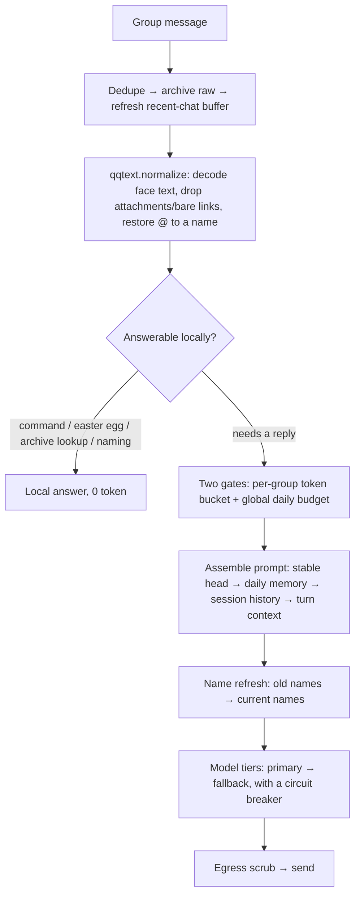

# micro-banter-harness

**English** · [中文](README.md)

## The Regular — a resident AI member of your group chat, not an assistant

**Version**: 1.1 · **Author**: Leo (dubianche123) · **Runtime**: Python 3.10+ / [qq-botpy](https://github.com/tencent-connect/botpy) · **License**: MIT
**Where it runs**: one real QQ group, 7×24 — every number below was measured there, not benchmarked

It does exactly one thing: **it hangs out in the group like a member**. It does not race to answer, does not summarize, never says "how may I help you". Most of the time it lurks, occasionally it jumps in with one line; it remembers who is who, who it is close to, who still owes someone a bubble tea. When a model provider drops, it switches to another — and when to switch back is decided by the cache.

**Code holds the state. The model only puts the state into words.**

> It is, in essence, a **micro harness**. The hard parts of a real agent harness — deterministic state, a stable prefix, predictable degradation — compressed to the size of one group member: no framework, no database, five dependencies, a few thousand lines. What is borrowed is not code, it is the trade-offs.

Affinity is an integer. The ledger lives in `state.json`; grading, decay and ranking are all computed by local code — the model never touches the number, so it cannot invent a past that never happened. Names work the same way: who is called what comes from the archive, and once someone renames themselves **the old name never appears in any text handed to the model again**.

---

## How it differs from "wire up an API and ship it"

| Common approach | What happens here | Why |
|:--|:--|:--|
| Let the model score affinity every turn | Model judges sentiment only; code applies the number | The number is code-owned, so the model can't make it up; no extra JSON demanded of it either |
| Feed it a week of chat logs as memory | Rolling compression: new summary = f(old summary, today's delta) | Constant cost regardless of how busy the group gets; also dodges mid-context forgetting |
| Rely on prompts to block sensitive words | Code wordlist + a model review pass | Controlled test: prompt-only left the count of leaked words **unchanged** (2 vs 2) |
| Let the model remember who is called what | Names are archive state, refreshed before injection | A stale name makes it call people by old names, or treat the old and new name as two different people |
| Switch providers when one drops | When to switch back is decided by **cache TTL** | Switching means recomputing the whole prefix; hit the cache while you can |
| Hardcode the **trigger word** (what the bot is called) / the owner's nickname | Resolved at runtime (`naming.py`); the trigger word comes from `BOT_NAMES` | Move to another group, hand it to someone else, or the owner renames — no code edits |
| Regex-enumerate message formats | Placeholders go through a renderer registry (`qqtext.py`) | A new platform format means adding one render function, not touching the parser |

---

## Running it in five minutes

### 1. Set the trigger word first (without it, it does not know you are calling)

The **trigger word** is the name the bot answers to in the group. It drives three things: detecting "is this message addressed to me", stripping the call-out prefix (「阿黄, name him 小满」 → 「name him 小满」), and the bot's self-reference inside prompts.

**This is the first thing to change on a deployment** — and the thing most likely to have been hardcoded: once a name is sprinkled through prompts, regexes, easter-egg lines and logs, moving to another person's machine or another group means going back into the code. So there is not a single concrete name in the source; it is all resolved at runtime.

There is **exactly one** authoritative source for the trigger word — `BOT_NAMES` in `.env`:

```env
# .env — multiple aliases, comma-separated
BOT_NAMES=the name you give it,alias1,alias2
```

Aliases are a genuine need: some people say the name, some @ it — both mean the same bot, hence the comma-separated list.

> ⚠️ **Renaming the bot on the QQ side is not how you set the trigger word.** The platform nickname (the bot's QQ username) is only a **supplement**: it is read once at startup and appended as one extra alias — it can only **add** a name, it will **never replace or override** what you wrote in `BOT_NAMES`. So renaming on QQ does not change the trigger word and the old names keep working; to change the trigger word, change `BOT_NAMES`. The nickname is also read at login, so **a rename needs a restart to take effect**.
>
> Only when both are unavailable (`BOT_NAMES` empty and no nickname) does it fall back to the generic word 「机器人」.

> ⚠️ Do not confuse the **trigger word** with an **address term**: the trigger word is "what this bot is called in your group" (this section); an address term is "what it calls members / the owner" (step 2's claim, `relations.py`). Both are configured, neither is hardcoded, but **if the trigger word is not set, every feature downstream simply cannot fire**.

#### It only supports the "receive all messages" kind of bot (and you switch it on by hand)

**Once you pull the bot into a group and set the group message scope to 「获取群内全部消息」 (obtain all messages), what it receives is every message in that group — not just the ones that @ it.** That is the premise of this project: it needs the surrounding context to decide whether to speak up and to remember what happened. Seeing only the @-mentions leaves it blind.

Mind the difference between **receiving** everything and **replying** to everything: it receives all messages, but whether it answers is a separate matter — it always answers when @-mentioned or called by its trigger word, chimes in probabilistically the rest of the time, and stays quiet for most messages (otherwise it would be a spam bot).

The platform offers **three scopes** for what a bot may see in a group. This project **is written for the third** (the platform's wording drifts between versions — you can tell them apart by asking "can it see chatter that does not @ it?"):

| Scope the platform offers | What it sees | How it fits this project |
|:--|:--|:--|
| Only when @-mentioned | Just the messages that mention it | ⚠️ Answers @-mentions, and **only** @-mentions |
| The @ message + a bit before it | The message that @-ed it, plus the few immediately preceding ones (10 in our testing) | ⚠️ Same, except it also carries that little stretch around the @ |
| All messages | Every message in the group | ✅ **This is what the project is written for** — and this scope is **not the default; you have to switch it manually** |

**First, separate "does not reply" from "cannot reply": on either of the first two scopes it still answers @-mentions normally and still responds to its trigger word — the wiring works.** What you lose is **context management only** — it cannot see what the group was talking about, so it remembers nothing and never chimes in on its own. In other words, on the first two scopes it degrades into a "answers only when @-ed" Q&A bot, and everything this project is after — behaving like a regular member of the group — stops being true. And **nothing errors**; it just silently gets dumber.

⚠️ That switch is **not in the QQ Open Platform — it lives in the QQ group itself**, and **only the group owner can change it, once per group**:
group settings → find the bot attached to the group → set 「机器人可获取的群聊消息范围」 (the range of group messages the bot may obtain) to 「获取群内全部消息」 (obtain all messages in the group).

On the code side there is a matching layer of event parsing — `botpy` only dispatches mention events by default, and `bot.py` dispatches `GROUP_MESSAGE_CREATE` into the main flow as well.

### 2. Claim the owner role (do not skip this)

Claiming happens **in a private chat (C2C), not in the group**. Send the passphrase to the bot in a private message; the first person to get it right is permanently written to `owner.txt` — from then on only they can name other members and use owner commands.

The default passphrase is 「认主」. **Change it to something only you know before deploying** (`.env`):

```env
OWNER_CLAIM_PHRASE=whatever you pick
```

> ⚠️ **Why not in the group**: group chat is a loudspeaker. Saying the passphrase there is saying it to everyone, on a first-come-first-served basis — any passing member, or even someone not in the group at all, can walk off with the role. So shouting it in the group **grants nothing**: the bot replies 「认领得私聊办」 (claim it in a private chat), at most once per group. Go ahead and try it.
>
> ⚠️ Claiming is **one-shot and non-transferable**: once claimed, anyone else who says the right passphrase just gets "someone already claimed this". So even if the passphrase leaks later, the seat cannot be taken over.
>
> ⚠️ This is the easiest step to miss and the hardest to self-diagnose: with nobody claimed, the bot chats normally and everything looks fine — except **every owner-only feature fails silently**. So it warns you on its own: the startup log states that no owner has been claimed, its first reply in the group carries a one-line how-to (once per group), and a private message that looks like a claim attempt but gets the passphrase wrong tells you so plainly.
>
> Changing the owner later: stop → delete `owner.txt` → restart, and let the new owner claim it.

One extra detail: the passphrase is registered as a runtime sensitive word. If anyone does say it in the group, the summary output scrubs it on the spot, so it never flows back through long-term memory into every prompt round (which would be pasting the passphrase into the model context).

### 3. Install dependencies

```bash
python3 -m venv .venv && source .venv/bin/activate
pip install -r requirements.txt
```

Five dependencies: `qq-botpy` / `openai` / `httpx` / `aiohttp` / `certifi`. **No database** (a single group's data fits in `json`), no web framework, no ORM.

### 4. Fill in `.env`

```bash
cp .env.example .env
```

Four values are enough to start:

| Variable | Meaning |
|:--|:--|
| `QQ_APP_ID` | AppID from the QQ Open Platform developer settings |
| `QQ_APP_SECRET` | Same page |
| `AI_PROVIDER` | `gemini` (fast, needs a proxy) or `zhipu` (direct, slower) |
| `GEMINI_API_KEY` / `ZHIPU_API_KEY` | The key for whichever provider you chose |

Everything else has a default and can be left out (full list in `.env.example` and `config.py`).
Two exceptions, both covered in the earlier steps: **`BOT_NAMES` (the trigger word, step 1) ships with no default name**, and `OWNER_CLAIM_PHRASE` (the claim passphrase, step 2) defaults to the publicly-known 「认主」.
Both providers speak the OpenAI-compatible protocol, so **the calling code is shared** — switching providers is one line.

### 5. Platform-side setup

- Create a bot on the QQ Open Platform and invite it to the group.
- **Set the group message scope to 「获取群内全部消息」** (the third of the three scopes in step 1). ⚠️ This switch lives in the **QQ group settings**, **only the group owner can change it, and it is per group** — it is not the event subscription on the Open Platform.
- **Claiming goes through a private chat, so enable the C2C (single-chat) message permission** — without it, the claim in step 2 gets no response at all, and silently so.
- Still in the sandbox? Add the test group to the sandbox list, or messages will never be pushed to you. Same for private chat: in the sandbox the other party must be on the test-member list.

### 6. Start it

```bash
./.venv/bin/python -u bot.py
```

As a long-running process:

```bash
nohup ./.venv/bin/python -u bot.py >> bot.log 2>&1 &
```

A proxy is required to reach Gemini from some networks (zhipu is direct and must be excluded, otherwise its traffic goes through the proxy too):

```bash
HTTP_PROXY=http://127.0.0.1:7890 HTTPS_PROXY=http://127.0.0.1:7890 \
NO_PROXY=bigmodel.cn,open.bigmodel.cn ./.venv/bin/python -u bot.py
```

Missing credentials make it **fail at startup and tell you which one is missing** — it never runs with a half-valid config.

---

## What the group can do with it

| Feature | How to trigger | Cost |
|:--|:--|:--|
| Chat | Mention it, or just say its **trigger word** (the aliases in `BOT_NAMES`) | 1 call |
| Jump in unprompted | No trigger — 8% chance per eligible message; 25% when the owner is being discussed | 1 call |
| Dice duel | 摇骰子 / 掷骰子 / 比大小 / 决斗 | 0, local text, still raises affinity |
| Local meme easter eggs | Just say the line (only when not mentioned; 40% chance, 60s cooldown; edit `LOCAL_MEMES` in `bot.py`) | 0 |
| Mode switch | 猫娘 / 风纪委员 / 发疯 / 算命 / 飙车 modes | 0 |
| Exit a mode | 恢复正常 / 正常点 / 冷静点 / 散会 / 收摊 / 吃药了 | 0 |
| Claim your name | 叫我阿远 / 我是阿远 / 取消我的称呼 / 别叫我了 | 0 if the wordlist rejects it / 1 if it needs a model review (~137 tokens) |
| (Owner) name someone else | @someone 叫他阿远 (they must have spoken in the group first so the bot has their ID) | same as above |
| Check a relationship | 查好感 / 我跟你多熟 | 0 |
| Leaderboard | 关系榜 / 点名册 / 群友榜 | 0 |
| Name table | 称呼表 / 谁是谁 | 0 |
| Group chronicle | 群史记 / 最近聊了啥 / 周报 | 0 |
| Promise ledger | 查账 / 谁请客 ; say 结清 when someone delivers | 0 |
| Look up an old message | 翻旧账 <keyword> (verifies against the raw archive) | 0 |
| Force a compression | 立刻总结 / 压缩记忆 | 1+ calls |
| (Owner) flavour command | 办他 / 拖出去 / 拿下 / 护驾 | 0 |
| Direct message | Just DM it | 1 call |

⚠️ **Renaming works in group chat only.** Nicknames are stored per group (`group_id|openid`),
and a DM carries no group id — so there is no way to tell which group the change belongs to.
Saying "call me Aryu" in a DM does **not** write anything; it gets a local pointer back to the
group (0 tokens, no quota spent). It is never silently swallowed.

Almost all commands are answered **locally, for zero tokens**, without touching a model at all.

---

## Names have a primary form, and only the latest version ever exists

This is the piece of state that is easiest to overlook and most likely to blow up.

A **primary name** is the version the person themself put in place. It has exactly two legitimate sources: the person claiming or renaming themself (`claim`), or the group owner authorising a rename for someone (`owner`). There is a single write path (`RelationStore.set_nick`), the legitimate sources are a hard-coded allowlist (`MAIN_NAME_SOURCES`), and anything else is refused outright — **including a clear**, so there is no half-open door where a name "can't be changed but can be wiped". That guard was added later: before it, the invariant only held because "no other call site happened to exist".

A **secondary name** is the playful layer: old names left behind by a rename, nicknames other people called somebody. It holds no archive field — it belongs to the `RenameLedger`, which rewrites stale literals to the **current** name just before injection. The direction is one-way: a secondary name can resolve into a primary one, never the reverse (`main_names()` is the exemption list).

A **primary name cannot be duplicated**: two people in one group may not go by the same name, or the bot cannot tell them apart. A name someone else holds is out of reach, owner authority included. What this must *not* block is overwriting: occupancy is tracked **by openid, not by literal**, so the person's own current name is always let through (they can rename themselves whenever), and the same goes for the owner renaming the person they @-mentioned. The two refusal reasons are worded differently — impersonation is "这个名字不让用", a collision is "群里已经有人叫这个了"; the owner hits the latter, and a message that matches the reason is what stops him from thinking the feature is broken.

The problem is that names show up in **model output**: long-term memory is written by the model and naturally contains names, and the session window holds what the bot itself said. So after a rename, **the old name is still sitting in those texts**, and they are injected into the prompt every turn — the model keeps calling people by the old name, and worse, it starts treating the old and new name as two different people and inventing history between them.

The fix is to treat names as **state**, not as text:

| Concern | How it is handled |
|:--|:--|
| Where names live | The relation archive (`relations` in `state.json`) — code-owned, out of the model's reach |
| Who may write a primary name | Only the person themself (`claim`) or the owner (`owner`); summaries, model inference and any automatic sync are refused |
| May two people share a name | No. Occupancy is tracked **by openid**, and the person's own current name is let through — so they can always overwrite their own |
| Where old names go | The `RenameLedger` only records "this name used to belong to whom" and **never enters the model context** |
| Before injection | A `refresh_names` pass rewrites old literals to the person's current name; revoked names become `（未留名·XXXX）` |
| Coverage | Group chronicle, daily memory, recent-chat background, the previous summary fed back to the compression model, and the 群史记 command output |
| On rename/revoke | The session window, long-term memory and daily MD are scrubbed too; `archive/` raw logs are never touched |
| Off limits | Any literal in the primary-name list (`main_names()`) — no automatic logic may rewrite it, including the rename/revoke history sync |

The result: on **every path**, the model can only ever see the current version of a name. Renamed three times, an old name later claimed by somebody else, a name revoked entirely — each case is handled separately by the ledger (once a name changes hands it is no longer rewritten, so the new holder is not dragged along).

One related hard rule: **relationships come from the archive only.** Anyone claiming to be the bot's father, or demanding to be called "master", is joking — and when asked "who am I", the bot may only answer from the archive, saying "no record" when there is none. This is not part of any persona; it is a shared floor across all modes (`prompts.PROMPT_SHARED_RULES`) — added after the bot was observed inventing a kinship out of a member's "I'm your dad" joke.

---

## What it remembers, and for how long

| Layer | Stored in | Lifetime / limit |
|:--|:--|:--|
| Session context | `state.json` (one per person per group, fully isolated) | 8 exchanges / 3000 chars, 30 min idle resets the topic |
| Raw messages | `archive/YYYY-MM-DD.jsonl` | 90 days by default; append-only, the **single source of truth** |
| Long-term memory (chronicle) | `memory/YYYY-MM-DD.md` + `state.json` | Compressed at 120 messages or 24 hours, whichever comes first; at least 15 messages to bother |
| Relation archive | `state.json` | ±3 per interaction, ±6 per daily settlement; no decay for 3 days, then 1 point per 2 days toward 0; pruned after 90 days idle |
| Rename ledger | `state.json` | Up to 300 entries per group; only used to rewrite history, never injected |
| Promise ledger | `state.json` | Nagging starts 24h after a promise; every 48h, at most twice; no unprompted messages 23:00–08:00 |

Why keep the raw logs at all: summaries are lossy and the model occasionally mixes people up. When it does, `翻旧账 <keyword>` goes back to the JSONL and checks — otherwise you just live with the error.

---

## Model routing: when to yield, when to come back

### Tiers are split by task, not by speed

| Task | Gemini | Zhipu | Why this one |
|:--|:--|:--|:--|
| Chat | 3.5-flash-lite → 3.5-flash → 3.6-flash | 4.7 → 4.5-air → 4-flash | This job needs quality; a bit of latency is tolerable |
| Compression | 3.5-flash-lite | 4.5-air → 4-flash | Compression does not share the chat prefix (switching models costs no cache), runs in the background, is not part of the persona — and **the stronger tier is more likely to be rejected by content filters**: same transcript, 4.7 returns error 1301, 4.5-air produces results |
| Name review | 3.5-flash-lite | 4.7 | Only the strong tier catches homophones, split characters and hints (4.5-air misses them and false-positives on legitimate nicknames) |

The `tier` argument in `call_model(messages, max_tokens, tier="chat")` is the switch; adding a new tier is one line in `_TIER_CHAINS`.

### Yielding: cache first

When the primary provider (Gemini) hiccups, it yields to the fallback (Zhipu). But **when it comes back** is not decided by a cooldown — it is decided by the cache:

```
available = circuit-breaker cooldown elapsed  AND  group idle for ≥ PROVIDER_CACHE_WARM_SECONDS (default 600s)
```

As long as the group keeps chatting, it stays on whoever is serving — the warm prefix on the yielded provider would be thrown away by switching back, and every message in a group chat directly follows the previous one, so a single cache hit pays for itself. Once the group goes quiet past the cache TTL, switching back is free, and only then does it retry.

Two companion rules:

- **Hard failures** (proxy down, region unsupported, invalid key) are not counted: one occurrence yields immediately. No model or key swap rescues those, and retrying only makes the group wait ten-plus seconds. The check must look at **the exception class name as well as the message**: when the proxy dies, `str(e)` is just `Connection error.` and contains none of the keywords.
- **Only yield if somebody else can serve.** If the fallback is down too, the primary must step up — otherwise one tripped breaker plus one dead provider takes the whole chain offline.

### Measured: how long does the cache actually live

`tests/probe_cache_ttl.py` (1340-char stable prefix, a few dozen tokens in total):

| Time since last request | Zhipu (≈994 tokens) | Gemini (≈1090 tokens) |
|:--|:--:|:--:|
| Warm-up | 1% | 0% |
| Immediate reuse | **99%** | 0% |
| 60s / 120s / 240s | 98% – 99% ✅ | 0% ❌ |
| 420s | **99%** (bound never reached) | 0% ❌ |

Two conclusions: Zhipu's cache lives at least 7 minutes, so the window is set to 600s for margin; and **Gemini never hit once**, not even on immediate reuse — at 1090 tokens the request is already above the documented 1024 floor, so the issue is not "too small", it is that this tier simply does not get implicit caching at this size. In other words, "cache first" only means something on the Zhipu side; switching back to Gemini throws away no cache at all.

> To reproduce: `cd tests && ../.venv/bin/python probe_cache_ttl.py --gemini` (~21 minutes, negligible token cost).

---

## The journey of one message



### The prompt layout is the cache strategy

```
1) Stable head   persona + shared rules + protocol + formatting   ← independent of who speaks and which turn; shared group-wide all day
2) Daily memory  group long-term memory                           ← changes once a day (only after compression)
3) Session       append-only per turn                             ← naturally prefix-stable
4) Turn context  recent chat + impression of speaker + banter cue ← all pushed to the very end
```

**Nothing that varies with speaker or turn may go into 1)** — everything after it is invalidated along with it. Group-owner identity, recent-chat background and relation notes used to all sit in the system block, which threw the cache away entirely. This invariant produces no error; it just quietly gets slower and more expensive, so a test pins it down (`tests/test_harness.py`). Project record: hit rate 85% before the reorder, 98% after.

### One more local scrub on the way out

The model sometimes copies sensitive words out of chat logs into memory. Summaries pass through `wordfilter.scrub` on the way out, replacing hits with a placeholder in place — replacing rather than deleting the line, because deleting truncates the sentence and looks broken.

---

## Open-sourcing, without your group's names

This bot was written from day one for the assumption that it would be open-sourced and moved into someone else's group, so the source contains **not a single real name**:

| Problem | Solution | Where |
|:--|:--|:--|
| **Trigger word (what the bot is called in the group)** ← highest priority | `BOT_NAMES` in `.env` (multiple aliases) is authoritative; the platform nickname is only a bonus alias and cannot override it; no default name is baked in | `naming.py` |
| How it refers to itself | The first entry of that same list, substituted through the `{bot}` placeholder | `naming.py` + `prompts.py` |
| How the owner is addressed | Whatever they claim (claim the role in a private chat, then say 「我是XX」 in the group); falls back to the generic 「群主」 | `naming.py` + `relations.py` |
| Names inside prompts/scripts | Always `{bot}` / `{owner}` placeholders, substituted by `naming.render` before sending | `prompts.py`, `bot.py` |
| Detecting "is it being called" / stripping the call-out prefix | Regexes built on the fly from that same trigger-word list; no literal hardcoded | `relations.py` |
| Owner nicknames hardcoded in the blocklist | Replaced by generic role words + **resolved from whoever currently holds the name** | `relations.py` |
| Stale names lingering in memory | Ledger + pre-injection refresh; the model only ever sees the current version | `relations.RenameLedger` |
| Who is allowed to write a name | An allowlist of sources (self-claim / owner-authorised), everything else refused | `relations.MAIN_NAME_SOURCES` |
| Sensitive words (homophones, hints, real names) | Never in the repo: generic words live in code, specific ones in `sensitive_nicks.txt` (gitignored, template in `sensitive_nicks.example.txt`) | `wordfilter.py` |
| Raw chat logs / summaries | `archive/`, `memory/`, `state.json` are all gitignored, plus `.backup/` (manual backups kept when wiping, equally sensitive) | `.gitignore` |

> The ordering matters: **the trigger word outranks the address terms.** Get an address term wrong and someone is mildly misnamed. Get the trigger word wrong and the bot is mute in your group — it will not answer, will not chime in, and nothing errors.

`naming.render` uses string replacement rather than `format` — the prompts contain literal braces such as `{"aff": 2}`, which would make `format` raise `KeyError`.

---

## Measured numbers

| Metric | Result | Note |
|:--|:--|:--|
| Reply latency | Gemini 3.5-flash-lite **1.1–1.7s** / glm-4.7 **4.7s** | Same 1186-char system prompt, banter request |
| prompt tokens | **297** vs 1149 | Same request; Zhipu is 4× Gemini |
| Prefix cache | Zhipu 99% hit (still warm at 420s); Gemini 0% | See table above |
| Prompt reorder | hit rate 85% → 98% | Recorded by `test_harness.py` |
| Banter rate | 8% × 113 candidates / 10.8 h ≈ **7 per day** | Counted from logs after launch |
| The length-threshold lesson | Of 257 messages, a 10-character floor admitted 19 — a third of them emoji strings | The floor was deleted; rate is governed by probability + cooldown only |
| Name review accuracy | 4.7 **7/7**; 4.5-air misses homophones and false-positives; 3.5-flash-lite **8/8** | 2 sensitive names vs 6 normal nicknames |
| Compression throughput | 4.5-air swallowed 260 messages / 4732 chars; 4.7 returned contentFilter 1301 on the same input | Evidence for using the weaker tier |
| Cost gates | Global ≤3000 calls/day; per-group bucket of 8, refilling 1 per 5s | Caps flooding at roughly 12 calls/minute |
| Regression suite | **237 tests** green, fully offline, no keys required | Dedicated tests for renaming, the primary-name guard, name-collision blocking, owner-claim and anti-hijack, name refresh, prompt order, passive-reply expiry, private-chat rename redirect, no raw ids in replies, group-display-name pairing and fallback, failover |

---

## Boundaries, and why certain things are not done

| Not done | Reason |
|:--|:--|
| Per-user quotas | In a group everyone is an equal member; throttling per person feels wrong. A per-group bucket plus a global daily budget keeps the bill predictable |
| Leaking machine ids into chat | openids, their last-four tails and group ids stay in the logs. Once one reaches the prompt — chat context, the relation note, the mention fallback, even the rename confirmation — the model reads it as somebody's name and repeats it, and the group sees an unreadable string. Related: when harvesting plain-text @-nicknames, **strip `<@!openid>` first** — measured, it gets cut by the length cap into a fragment that is then learned as "this person is called E5E3793C…" and sent straight back to the group, so the `DisplayNames.learn` write gate blocks it too |
| Resending expired messages | Tencent's passive replies expire (5 minutes for groups) and resending one is always rejected. Messages buffered during a disconnect are mostly expired by the time they are replayed, so it checks `message.timestamp` first and just logs the skip — firing a request that cannot succeed is worse than not firing at all |
| Letting "cache first" deadlock the providers | "Don't switch back while the cache is warm" can self-lock: A yields because B looks able, B yields because A looks able, and neither one works. The symptom is deceptive — the process is alive, messages arrive, it even replies, but every reply is the same "sorry, spaced out" fallback, **so it looks like an outage**. So it first asks "can anyone actually take over?", and if not it drops the yield rule and picks on circuit-breaker state alone — one extra prefill beats staying silent |
| A message-length threshold | A bare 「？」 or 「太蠢了」 is a genuine cue to jump in; measuring by character count only filters out the messages worth answering |
| Multimodal (image reading) | Faces and images that read as nothing are dropped entirely, not archived — the complexity of adding multimodal far outweighs the benefit |
| A database | One group's data fits in JSON; one less dependency is one less deployment trap |
| Regex-enumerating message formats | A new platform placeholder is one new `@renderer`, the parser is untouched |
| Canned example lines in prompts | The model copies examples as templates (5 of 5 outputs started with the same phrase), so prompts describe the effect instead |
| Relying on prompts to keep relationships correct | Prompts do not stop homophones and do not stop invented kinship — so relationships live in the archive, old names in the ledger, and code enforces both |
| Letting automatic logic touch primary names | One override and the person stops trusting the bot; the only write sources are "the person themself" and "owner-authorised rename", and an illegal source cannot even clear the name |
| Calling the platform's group-member API for display names | The route exists but needs a separate permission grant (measured: `400 11253 应用无接口访问权限`); one more approval just to render a name is not worth it. Instead it learns the **plain-text nickname** left behind when someone is @-mentioned |
| Guessing which openid a plain-text @ belongs to | `mentions` comes in the order the @s appear, so it pairs them one by one **when the plain-text count matches the mention count**, and drops the whole message when it does not (a hand-typed fake @, or an @ rendered as a placeholder). Mislabelling someone is worse than not knowing — the bot would call you by someone else's name in public. And when it does get one wrong there is a way out: the person says `call me X` and it is overridden, since a claimed name always wins |

---

## Troubleshooting

| Symptom | Likely cause |
|:--|:--|
| It never responds in the group | ①Check the **trigger word**: if `BOT_NAMES` is unset and the platform nickname is unavailable, it only answers to the generic 「机器人」; ②the group message scope is still on one of the first two levels (the group owner changes it to 「获取群内全部消息」 in the QQ group settings); ③the group is not in the sandbox list |
| A few messages got no reply at all, yet the log says `⏳ …超过被动回复时效` | Not broken — **deliberately skipped**. Messages that piled up while the connection was down get replayed on reconnect, by which time they are past Tencent's passive-reply window (5 minutes for groups). Sending anyway is rejected (`40034005`), so it logs one line and moves on instead of firing a request that is certain to fail |
| It answers @-mentions but never chimes in or remembers context | The group message scope is stuck on one of the first two levels (only @ / @ + the previous 10). It cannot see the whole conversation, so it cannot judge whether to speak up or remember anything. **The group owner** changes 「机器人可获取的群聊消息范围」 to 「获取群内全部消息」 in the QQ group settings, once per group. See the table in step 1 |
| Calling its name does nothing, but @ works | The trigger word does not match what people actually say: add it to `BOT_NAMES`. Renaming it on QQ will not help — a nickname only adds an alias, it never overrides what `BOT_NAMES` already has |
| The first reply after startup is slow | Cold start, not yet warmed; startup performs one 0-token connectivity probe (measured 0.35s) |
| Owner commands do nothing / cannot name others | No owner has claimed the role: have them send the passphrase from `OWNER_CLAIM_PHRASE` to the bot in a **private chat**; to change owners, delete `owner.txt` first. Shouting it in the group does nothing, deliberately |
| Log says "no owner claimed yet" | Same as above. That log line exists so this problem stops being silent |
| Sent the passphrase in private chat, no response | Most likely the QQ Open Platform never enabled the **C2C (single-chat) message permission**; or `OWNER_CLAIM_PHRASE` was left empty (which closes the private-chat claim channel) |
| Log says "yielding (cache still warm)" | Normal — cache-first at work; it switches back once the group goes quiet |
| It stays on Zhipu and never returns to Gemini | Same as above. Lower `PROVIDER_CACHE_WARM_SECONDS` if that bothers you |
| A name was rejected | Two gates: local wordlist (role words / honorifics / `sensitive_nicks.txt`) plus model review; if the review service is down it lets names through, the wordlist still holds |
| It still calls someone by an old name | Should no longer happen: names are refreshed before injection and scrubbed from history on rename. If it does, check whether the old name is registered in `renames` in `state.json` |
| It treats two people as one / invents a relationship | First check whether the old name reached `renames`; relationships come only from the `relations` archive — anything beyond that is the model improvising, so check whether 群史记 has been polluted |
| Start completely over | Stop → delete `state.json` (memory / affinity / modes / ledger), `archive/`, `memory/` (raw logs and summaries) and `owner.txt` (re-claim the owner) |

---

## Layout

| File | Responsibility |
|:--|:--|
| `bot.py` | Main flow: receive → decide whether to answer → local easter egg or model call → send safely |
| `config.py` | All configuration and defaults, provider presets, startup validation |
| `prompts.py` | Persona prompt library + the shared hard rules (change the persona here only; no names) |
| `naming.py` | The single source of truth for "what is the bot called" and "how is the owner addressed" |
| `relations.py` | Relation archive (grades, decay, ranking) + the old-name ledger |
| `digest.py` | Rolling long-term memory compression + the promise ledger |
| `archive.py` | Raw JSONL archive + daily Markdown output |
| `storage.py` | State persistence, session context, token bucket, daily budget |
| `qqtext.py` | Message normalisation: turn "human text + machine placeholders" into readable text |
| `wordfilter.py` | Sensitive words: one wordlist shared by the naming entry point and the summary exit |
| `tests/` | 237 regression tests + a few one-off probe scripts |

Run the tests (fully offline, no network or keys):

```bash
cd tests && for f in test_*.py; do ../.venv/bin/python "$f"; done
```

---

## Moving groups / switching providers

| Goal | Change |
|:--|:--|
| Move to another group | Just change the **trigger word**: set `BOT_NAMES` to whatever your group calls it, then let it learn address terms on its own; not a line of code changes |
| Change its trigger word / what it is called | `BOT_NAMES` (`.env`, comma-separated aliases) — the only entry point; see step 1 of "Running it in five minutes" |
| Switch the primary provider | `AI_PROVIDER` (both are OpenAI-compatible; the calling code is shared) |
| Rotate multiple keys | Create `api_keys_gemini.txt` / `api_keys_zhipu.txt` next to the code, one key per line, `#` starts a comment |
| Tune the banter rate | `BANTER_PROBABILITY` (0.08), `OWNER_MENTION_PROBABILITY` (0.25), `BANTER_COOLDOWN_SECONDS` |
| Change the local memes | `LOCAL_MEMES` in `bot.py` — one dict, zero cost |

---

## License

MIT — use it for anything, commercial included. The bot stands behind what it says; I do not.

<p align="center"><sub>micro-banter-harness — The Regular · Code holds the state; the model only puts it into words.</sub></p>
